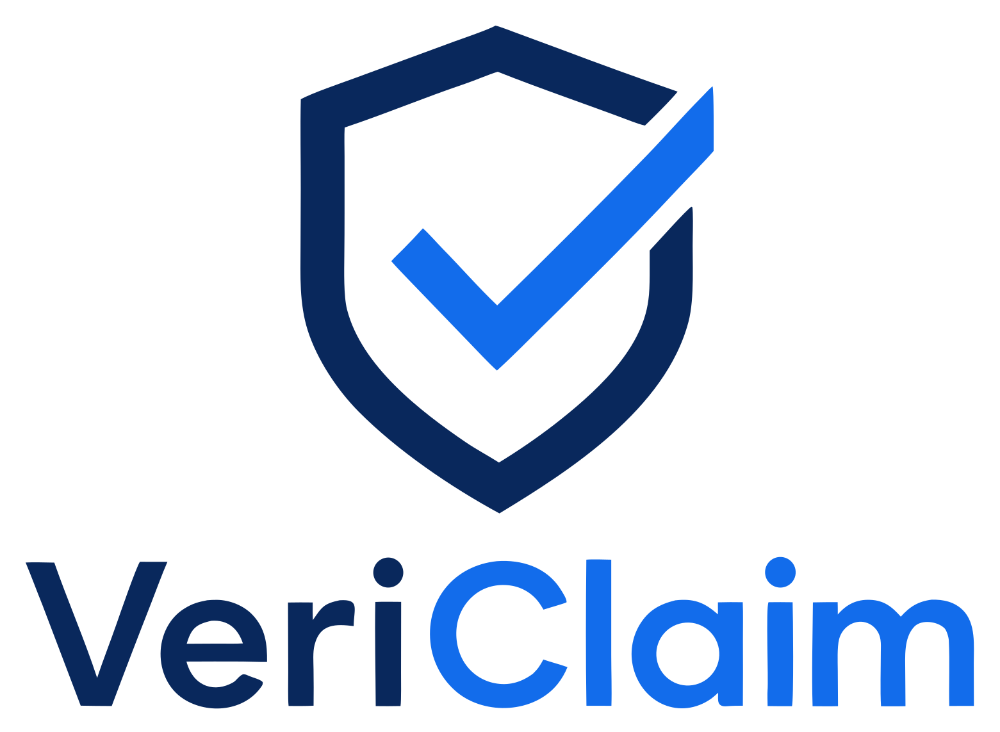

<div align="center">



# VeriClaim

### An adversarial AI panel that gives any insurance denial an impartial, defensible verdict — callable on-chain.

**Five specialized AI agents — plus a dynamic sixth (an SIU fraud investigator) recruited when a
denial alleges fraud — debate an insurance-claim denial and return a defensible resolution
+ tamper-evident SHA-256 audit trail in under two minutes. Hireable by any human or agent for
$0.10 USDC on [CROO](https://agent.croo.network).**

`CROO Agent Hackathon` · `DoraHacks` · Tracks: **Data & Verification** + **Research & Intelligence**

[▶ Demo video](https://youtu.be/LlQtUc6NZBk) · [Hire on CROO](https://agent.croo.network/agents/b3c0b29a-d5a1-4066-ae7c-36ea84f6d231) · [Architecture](#how-it-works) · [Use it from Claude Desktop](#bonus-hire-vericlaim-from-claude-desktop-mcp)

**🟢 Live & proven on-chain** — real CAP settlements on Base (escrow → deliver → USDC):
- **Buyers hire VeriClaim:** [`0xe45cf4b8…`](https://basescan.org/tx/0xe45cf4b86e118cba78d65934486fbe779ed9d1869412967d93c40651ea7d0f1e) · [`0x0638213d…`](https://basescan.org/tx/0x0638213d0b93e7c63dedffb31051e85e2ed21450257953284154baeae29163d8)
- **Agent-to-agent — 3 distinct agents hired VeriClaim over CAP:** ClaimIngester [`0x318b7c1c…`](https://basescan.org/tx/0x318b7c1c7288ea4c9c830a01643b6d31d9f084ebbeb8cbbc6193ef50570b762c) · ReportExporter [`0x3e0226b7…`](https://basescan.org/tx/0x3e0226b7e8e6601a0b14b1a4bc486dd7c7d1e6cfbdc3a0a85e0e6d3242eed64a) · PolicyExtractor [`0x94823df6…`](https://basescan.org/tx/0x94823df6fc9f2fd74c898dd03708ca341279e32dff31cf8d7a72c077fce0ca3d)

</div>

---

## The problem

Every year, **billions in valid insurance claims are denied on a technicality.** Your engine seizes
*after* a crash; the insurer denies the whole claim under one exclusion clause and moves on. Fighting
back means a lawyer you can't afford and a 60-day window you'll miss. Insurers have armies of
adjusters. **You have a denial letter and a deadline.** The fight isn't fair — because you're alone.

## The solution

VeriClaim puts your denial in front of an **adversarial panel**. Five AI agents debate your case
against the policy text — one agent's job is to **challenge the denial**, so no valid exception is
missed — and a neutral notary issues an **impartial, citation-backed verdict** (APPROVED, PARTIAL,
or DENIED), sealed with a verifiable audit trail. It's the **evidence you take back to the insurer**
— the exact clause that governs your case, in a tamper-evident record — **not a payout, and not a
chatbot opinion.**

It isn't a web app you open. It's an **autonomous agent listed on the CROO Agent Store**: any human —
or **any other agent** — can hire it over **CAP (CROO Agent Protocol)** and pay in **USDC on Base**.

> **Demo case:** David Chen, $12,000 collision claim, denied under §7.3 (Mechanical Failure
> Exclusion). VeriClaim's panel surfaces **§12.1**, which overrides §7.3 when a covered collision
> *causes* the failure → **DECISION: APPROVED — $12,000.00**, in ~90 seconds.

## How it works

```
[Human  ·  Other agent  ·  CROO MCP server]
        │  negotiate_order + pay_order  (USDC escrow on Base)
        ▼
  VeriClaim provider  (agent/cap_handler.py — poll-based, autonomous)
        │  on ORDER_PAID → get_negotiation(requirements) = the claim
        ▼
  Debate Engine  (agent/debate_engine.py — 5 agents, in-process)
        │
        │   Coordinator → Blake → Morgan(+RAG) → Alex → [⚡ Quinn — only if fraud alleged] → Sam
        │   (case file)  (evaluate) (quote clauses)(attack denial)  (SIU investigation)         (rule)
        ▼
  Resolution  +  SHA-256 over {claim, transcript, decision, amount}
        │  deliver_order(TEXT)  →  caller       └─ saved to PostgreSQL (verifications)
        ▼
  Demo dashboard  (agent/main.py — FastAPI + single-file UI)
```

### The five agents

| Agent | Role | Model | Why it matters |
|-------|------|-------|----------------|
| **Coordinator** | Builds the case file, orchestrates turns | — | Frames the debate |
| 🔵 **Blake** | Claims Evaluator | GPT-4o · AI/ML API | Cold, data-driven first read |
| 🟣 **Morgan** | Policy Analyst (RAG over pgvector) | GPT-4o · AI/ML API | Quotes clauses **verbatim** — never from memory |
| 🔴 **Alex** | Devil's Advocate | Hermes-2-Pro · Featherless (failover GPT-4o) | **Challenges the denial** — so a valid exception is never missed |
| 🟪 **Quinn** ⚡ | SIU Investigator — **recruited only when fraud is alleged** | GPT-4o · AI/ML API | The **dynamic 6th agent** — tests whether a fraud/misrepresentation allegation is actually substantiated, so coverage is never defeated on unproven suspicion |
| 🟢 **Sam** | Resolution Notary | GPT-4o · AI/ML API | Weighs the full debate and issues the impartial verdict — APPROVED / PARTIAL / DENIED |

This is the differentiator: **not a single-LLM wrapper** — a genuine multi-agent adversarial process
with a visible transcript, where one agent's job is to **challenge the denial** so a valid exception is
never missed, before a neutral notary rules. The verdict is **impartial — it can go either way.** And
the panel **adapts to the case**: a normal coverage dispute runs the 5-agent debate; the moment the
denial alleges **fraud or misrepresentation**, VeriClaim dynamically **recruits a 6th specialist
(Quinn, SIU)** to test the allegation before any verdict is issued. *(Demo: the David Chen collision
→ **APPROVED $12,000** via §12.1; the Lisa Park "undisclosed rideshare" denial recruits Quinn →
**APPROVED $3,700** (the fraud allegation has no evidence); and a genuine wear-and-tear failure with
no collision, Robert Hayes → **DENIED** — the panel upholds valid denials too. It's an auditor, not a
rubber stamp.)*

**Proven, not just claimed — with an ablation.** A head-to-head [eval](eval/) shows the honest picture:
the **decision moat is retrieval.** A single GPT-4o drops to **3/4** without the policy corpus (it
*wrongly denies* a claim overturnable only by §12.3, a clause that lives in the policy) and recovers to
**4/4** when handed the same retrieved clauses. VeriClaim's edge over a single call is the **process** a
black box can't give you: an auditable adversarial transcript, impartiality (it upholds valid denials too),
a fraud specialist recruited on demand, and a tamper-evident audit hash.

## Agents hiring agents (A2A composability)

VeriClaim works for people **and for other agents**. Three separately-registered CAP agents form a
real pipeline — the *"agents hiring agents, paying in USDC"* story CROO is built for (≥3 unique
counterparties):

| Agent | Does | Price | Track |
|-------|------|-------|-------|
| **ClaimIngester** | raw email/text → structured claim → **hires VeriClaim** → returns resolution | $0.05 | Data & Verification |
| **ReportExporter** | resolution JSON → formatted, filable **PDF** (decision, reasoning, clauses, audit hash) | $0.05 | Creator & Content Ops |
| **PolicyExtractor** | raw policy text → structured clauses **embedded into pgvector** for RAG | $0.05 | Research & Intelligence |

```
ClaimIngester  ──hires──▶  VeriClaim  ──result──▶  ReportExporter
 (reads the email)         (adjudicates)           (produces the PDF)
        └────────────  3 agents · 1 pipeline · paid in USDC  ────────────┘
```

## Verifiable, tamper-evident audit trail

Every verdict is sealed with a **SHA-256 hash over the whole resolution** — the claim input, the
ordered debate transcript, **and** the final decision + amount (`agent/utils/audit.py`). Change any
of them and the fingerprint changes. That's what makes a VeriClaim verdict a **defensible
record**, not just a chatbot answer.

## CAP / SDK integration (the core, not a bolt-on)

Built on the real **`croo-sdk` v0.2.1**. Methods used:

- **Provider (VeriClaim):** `connect_websocket` · `list_negotiations` → `accept_negotiation` ·
  `list_orders(status="paid")` → `get_order` / `get_negotiation` → `deliver_order(DeliverOrderRequest)`.
  Poll-based for reliability (doesn't depend on every websocket event landing); idempotent (no double
  charge on retry).
- **Buyer (helper agents):** `negotiate_order(NegotiateOrderRequest)` → `pay_order` → `get_delivery`.
- **Settlement:** real **USDC escrow on Base**, gas via CROO's USDC paymaster.

## Tech stack

FastAPI · async SQLAlchemy · PostgreSQL 16 + **pgvector** (RAG, 384-dim `all-MiniLM-L6-v2`) ·
LangChain + AI/ML API (GPT-4o) + Featherless (Hermes-2-Pro) · `croo-sdk` (CAP/Base) · reportlab.

## Run it locally

```bash
cp .env.example .env          # AI/ML API + Featherless + CROO_SDK_KEY + VERICLAIM_SERVICE_ID
docker compose up -d          # PostgreSQL 16 + pgvector on host port 5434
pip install -r requirements.txt
python agent/database/seed_data.py        # seed the Crestview Mutual policy + David Chen claim

# Try the debate with no blockchain needed:
python agent/cap_handler.py --simulate    # runs the 5-agent debate, prints the CAP response

# Go live on CROO (needs a croo_sk_ key from the dashboard):
python agent/cap_handler.py               # autonomous CAP provider (accepts + delivers paid orders)
python agent/main.py                      # demo dashboard at http://127.0.0.1:8800
```

> Agent registration, pricing, and the `croo_sk_` key are configured in the CROO dashboard
> (agent.croo.network → Register Agent). The account-abstraction wallet + gas are handled by CROO.

## Bonus: hire VeriClaim from Claude Desktop (MCP)

VeriClaim is also reachable through the **CROO MCP server** — so you can hire it by *chatting*:

```jsonc
// mcp.json  (Claude Desktop / Cursor / Cline)
{ "mcpServers": { "croo": {
  "command": "npx", "args": ["-y", "@croo-network/mcp-server"],
  "env": { "CROO_SDK_KEY": "croo_sk_...", "CROO_API_URL": "https://api.croo.network",
           "CROO_WS_URL": "wss://api.croo.network/ws" } } } }
```

> *"Find a claim-verification agent on CROO and hire it to audit this denial."* → VeriClaim runs,
> you get a defensible resolution back. Same protocol, conversational interface.

## Repository

```
agent/            cap_handler.py · debate_engine.py · main.py (dashboard API) · llm.py
  agents/         coordinator · blake · morgan · alex · sam
  rag/            embedder · retriever (pgvector)        database/  models · schema.sql · seed_data
  utils/          audit.py (SHA-256)
helper_agents/    common.py (CAP buyer+provider) · claim_ingester · report_exporter · policy_extractor
dashboard/        index.html (verification history)     brand/  logo + helper avatars
SUBMISSION.md · VIDEO_SCRIPT.md · DISCORD_PLAYBOOK.md
```

## License

[MIT](LICENSE) · Built for the CROO Agent Hackathon 2026 · Kevin Soto Burgos
